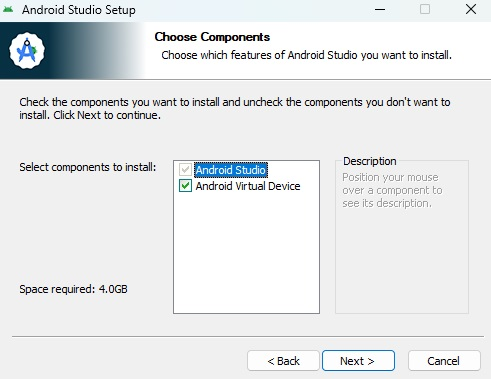
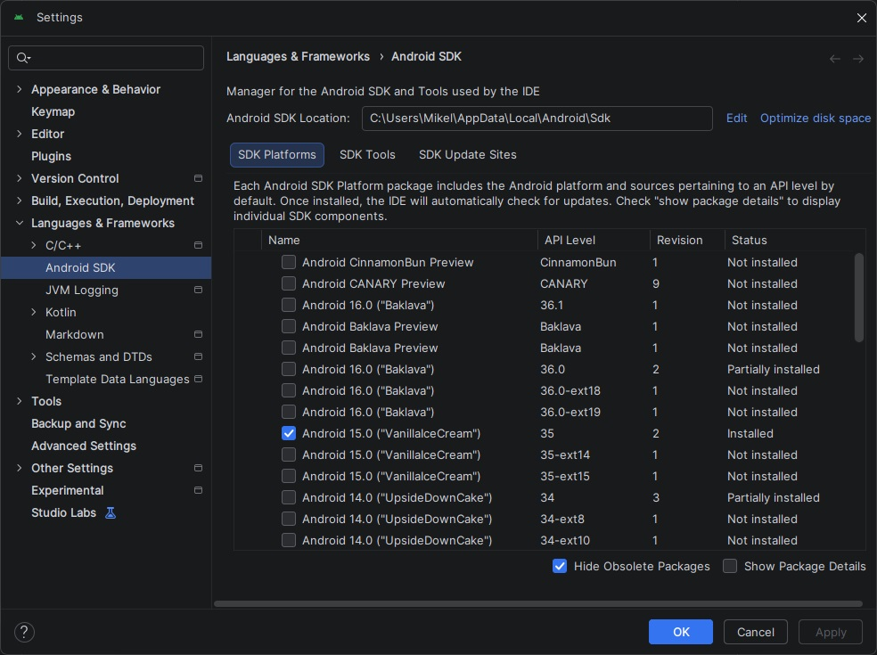
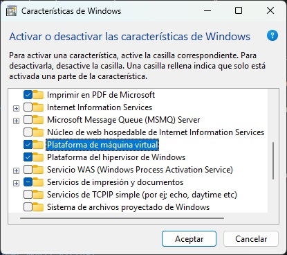
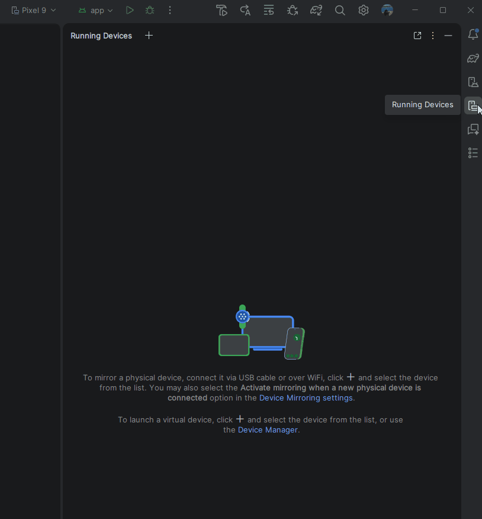
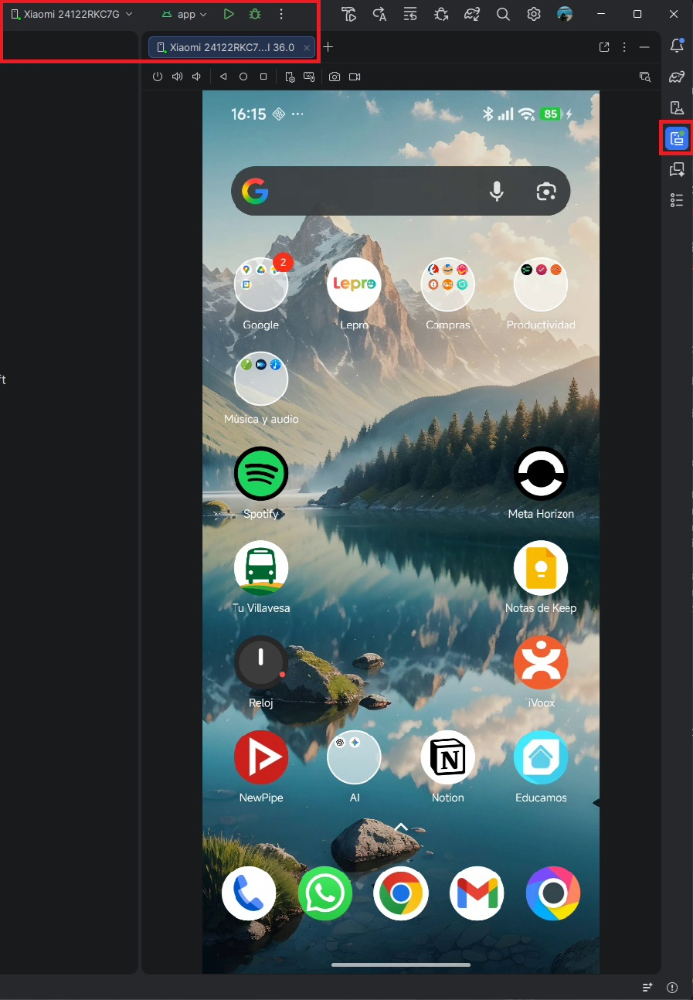

# Instalación y Emuladores

Para programar en Android en 2026 no vale cualquier editor de texto. Necesitamos nuestra "nave nodriza": **Android Studio**. Es el entorno de desarrollo oficial de Google y, aunque al principio tiene tantos botones que asusta, pronto se convertirá en tu mejor aliado.

En esta lección vamos a instalar el entorno, descargar las herramientas necesarias (SDK) y, lo más importante, configurar tu ordenador para que el móvil virtual (emulador) no se arrastre a pedales.

---

## Descarga e Instalación

Lo primero es descargar la versión oficial y Estable de Android Studio. Huye de las versiones *Beta* o *Canary* por ahora; en clase queremos estabilidad, no experimentar con bugs.

👉 [Enlace oficial de descarga de Android Studio](https://developer.android.com/studio?hl=es-419#get-android-studio)

Durante la instalación, el asistente te hará varias preguntas. La regla de oro es: ante la duda, dale a **"Next"** sin modificar nada.

<figure markdown="span">
  
  <figcaption>Figura 1: Elige siempre el tipo de instalación "Standard" para que el asistente descargue los componentes básicos por ti.</figcaption>
</figure>

---

## El SDK (Software Development Kit)

Android Studio es solo la carcasa. Para construir apps, necesita el SDK, que es básicamente la caja de herramientas con las piezas de Android (compiladores, librerías, etc.).

Al abrir Android Studio por primera vez, te pedirá descargar el SDK más reciente. Déjale hacer su trabajo. Dependiendo de tu conexión a internet, este es un buen momento para ir a por un café. ☕

<figure markdown="span">
  
  <figcaption>Figura 2: Desde el SDK Manager podrás descargar futuras versiones de Android conforme vayan saliendo al mercado.</figcaption>
</figure>

---

## El Emulador y el "Trauma" de la Virtualización

Aquí es donde el 50% de los programadores novatos se atascan el primer día. 

Para no tener que conectar tu móvil físico por cable constantemente, usamos el **Device Manager** para crear teléfonos virtuales (Emuladores) dentro de tu pantalla. Pero para que un ordenador mueva un móvil virtual de forma fluida, necesita usar una tecnología del procesador llamada **Virtualización**.

!!! danger "¡ATENCIÓN! EL 'JEFE FINAL' DE LA INSTALACIÓN"
    Si al intentar arrancar el emulador recibes un error en rojo o la pantalla se queda en negro infinitamente, el problema es la virtualización de tu PC. Hay dos posibles culpables en **Windows**:
    
    1. **La BIOS (VT-x / AMD-V):** La virtualización está apagada en la placa base de tu ordenador. Tendrás que reiniciar el PC, entrar en la BIOS y activar "Intel Virtualization Technology" o "AMD SVM".
    2. **El hipervisor de Windows:** En ordenadores modernos, el emulador utiliza la tecnología nativa de Windows (WHPX). Ve al menú de inicio, busca "Activar o desactivar las características de Windows" y asegúrate de tener marcada la casilla "Plataforma del hipervisor de Windows". (Nota: Si tienes Windows Pro, asegúrate también de que "Hyper-V" no esté causando conflictos si usas software antiguo, aunque hoy en día conviven pacíficamente).
-
<figure markdown="span">
  
  <figcaption>Figura 3: Ventana de características de Windows. Esta configuración es vital si tu procesador AMD o Intel entra en conflicto con el emulador.</figcaption>
</figure>

---

### Creando tu primer móvil virtual

Si has sobrevivido a la virtualización, el resto es un paseo.

1. Abre el **Device Manager** (icono de un móvil en la barra lateral derecha).
2. Haz clic en el botón de crear nuevo dispositivo (`+`).
3. Selecciona un modelo estándar (ej. Pixel 9 o el modelo actual de referencia) que tenga el icono de la Play Store al lado.
4. Descarga la imagen del sistema (la versión de Android) y dale a Finalizar.

<figure markdown="span">
  
  <figcaption>GIF 1: Arrancando nuestro dispositivo virtual desde el Device Manager. Si aparece la pantalla de inicio de Android, ¡enhorabuena, tu taller está listo!</figcaption>
</figure>

---

Ya tienes el entorno configurado, el motor engrasado y el móvil virtual encendido. En el siguiente apartado vamos a ensuciarnos las manos creando nuestro primer proyecto real para ver qué carpetas importan y cuáles no.

---

## (Alternativa): El Mundo Real (Tu dispositivo físico)

Si el emulador te da problemas de rendimiento o simplemente quieres sentir el poder de tu código en tus propias manos, conectar tu móvil físico es la mejor opción. 

!!! tip "La magia del Device Mirroring"
    Gracias a esta función de Android Studio, podemos ver e interactuar con la pantalla de tu móvil físico directamente dentro de la ventana del programa, usando el ratón de tu ordenador. 

Para prepararlo, solo tienes que seguir estos pasos:

1. **Despierta al Desarrollador:** En tu móvil Android, ve a `Ajustes > Información del teléfono` y toca 7 veces rápidas y seguidas sobre el **Número de compilación** (*Build number*). Te pedirá tu PIN y te avisará de que "¡Ya eres un desarrollador!".
2. **Activa la Depuración:** Vuelve al menú principal de Ajustes, entra en el nuevo menú de **Opciones para desarrolladores** (suele estar dentro de `Sistema`) y activa la **Depuración por USB** (o *Depuración Inalámbrica* si tu móvil y PC están en la misma red Wi-Fi y prefieres hacerlo sin cables).
3. **Conecta y Autoriza:** Conecta el móvil al PC. Te saltará una alerta de seguridad en la pantalla del teléfono preguntando si confías en la huella RSA de ese ordenador. Marca *"Permitir siempre desde este ordenador"* y dale a Aceptar.
4. **El Espejo (*Mirroring*):** En Android Studio, abre la pestaña **Running Devices** (suele estar en el panel lateral derecho). Tu móvil aparecerá ahí y verás la pantalla de tu teléfono incrustada en el editor. ¡Puedes usar el ratón del PC para interactuar con tu pantalla táctil!

<figure markdown="span">
  
  <figcaption>Figura 4: Con la función Device Mirroring (asegúrate de tenerla activada en <code>Settings > Tools > Device Mirroring</code>), puedes controlar tu móvil físico sin soltar el ratón.</figcaption>
</figure>

---

  [Tu Primer Proyecto (Estructura de Carpetas) ➡️](b1-m0_2-primer_proyecto.md){: .md-button .md-button--primary }

