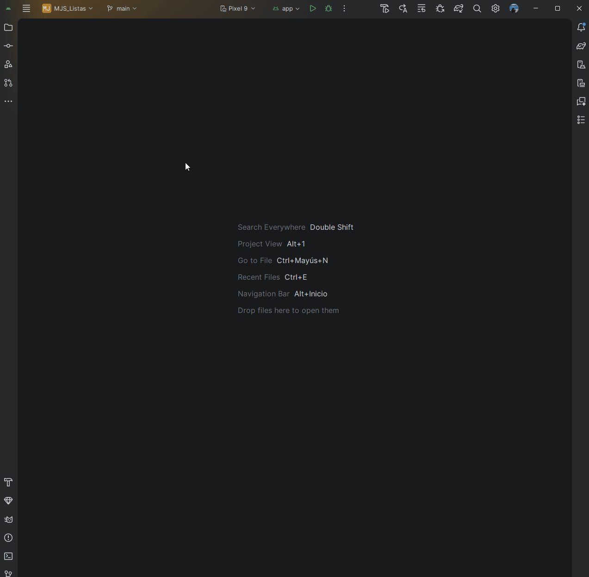
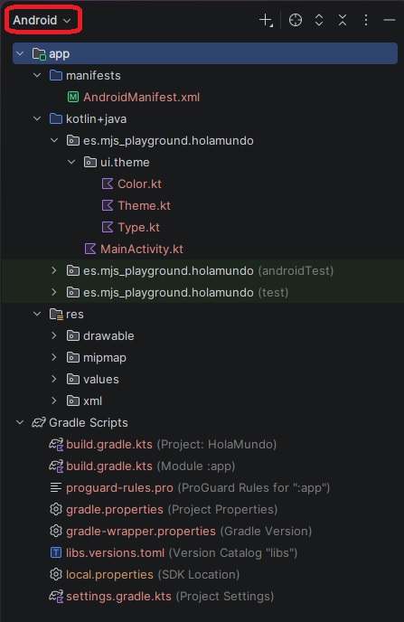

# Tu Primer Proyecto: estructura de carpetas

Ha llegado el momento. Vamos a crear nuestra primera aplicación.

Cuando Android Studio genera un proyecto nuevo, crea literalmente docenas de archivos y carpetas automáticamente. La reacción más normal al verlo por primera vez es el pánico absoluto. Tranquilidad. En nuestro día a día, vamos a ignorar el 90% de esos archivos y nos vamos a centrar exclusivamente en tres carpetas.

Vamos a crear el proyecto paso a paso y a destripar su estructura básica.

---

## Paso 1: Creando el proyecto (La plantilla correcta)

Android Studio nos ofrece muchas plantillas (con menús laterales, con mapas, con relojes...), pero en este curso vamos a construir la casa desde los cimientos. Siempre empezaremos con un lienzo en blanco.

1. Ve a `File > New > New Project...`
2. Selecciona la plantilla **Empty Activity** (¡Ojo! En las versiones modernas de Android Studio, "Empty Activity" usa Jetpack Compose por defecto, mientras que la antigua versión con XML se llama "Empty Views Activity". **Asegúrate de elegir la de Compose**).
3. Ponle un nombre a tu app, deja el lenguaje en **Kotlin**.
4. Asegúrate de que el *Minimum SDK* está en **API 28**. Esto lo explicaremos más adelante pero lo hacemos para evitarnos peleas con librerías antiguas. Además, durante la creación de este tutorial ya marca un uso del 95.3% de los dispositivos Android por lo que no perderemos cuota de mercado.
5. En el desplegable Build configuration language, selecciona Kotlin DSL (build.gradle.kts). Es el estándar moderno y el que usaremos en toda la teoría (olvídate de Groovy ya que es el pasado).
6. Dale a *Finish* y deja que el motor (Gradle) construya el proyecto. La primera vez tardará un poco, sé paciente.

<figure markdown="span">
  
  <figcaption>GIF 1: Creación de un proyecto con Jetpack Compose. Fíjate bien en elegir 'Empty Activity' y no la versión 'Views' legacy.</figcaption>
</figure>

---

## Paso 2: El Árbol del Proyecto (Qué mirar y qué ignorar)

Una vez que el proyecto cargue y la barra inferior termine de procesar, verás un panel a la izquierda con muchas carpetas. 

Asegúrate de que el desplegable superior de ese panel está configurado en la vista **"Android"** (y no en la vista "Project"). Esta vista está diseñada específicamente para ocultar la basura técnica y mostrarte solo lo que un desarrollador necesita ver.

<figure markdown="span">
  
  <figcaption>Figura 1: La vista 'Android' simplifica el caos. Céntrate solo en lo que está resaltado, el resto de carpetas las gestiona el sistema por ti.</figcaption>
</figure>

---

### Las 3 Carpetas de la Verdad

Todo tu trabajo durante este año se va a dividir en estas tres ubicaciones:

#### 🧠 1. La carpeta `kotlin+java` (El Cerebro)
Aquí vive todo tu código fuente. Aunque programemos en Kotlin, por razones históricas de compatibilidad la carpeta se sigue llamando `+java`. Dentro encontrarás tres subcarpetas con el nombre de tu paquete (ej. `es.mjs_playground.holamundo`).

* La primera es donde programaremos nuestra app.
* Las otras dos (que terminan en `(androidTest)` y `(test)`) las ignoraremos hasta el Bloque 6, ya que sirven para hacer pruebas automáticas.

#### 🎨 2. La carpeta `res` (Los Recursos)
Aquí vive todo lo que **NO** es código. Imágenes, iconos, tipografías personalizadas y textos traducidos. 

!!! warning "Regla de oro"
    Nunca, bajo ningún concepto, se meten archivos de código Kotlin aquí. Todo lo visual y estático va en `res`. (Lo veremos a fondo en el Módulo 4).

#### ⚙️ 3. La sección `Gradle Scripts` (El Motor)
Aquí viven las instrucciones de compilación. No es una carpeta real, sino una agrupación que hace Android Studio para que tengas a mano los archivos `.kts`. Aquí es donde le decimos a Android Studio cosas como: *"Oye, voy a usar esta librería de Internet"* o *"La versión mínima de mi app es la 28"*.

??? info "Curiosidad: ¿Qué son esas carpetas que ignoramos? (Haz clic para expandir)"
    Si cambias la vista de "Android" a "Project", verás carpetas como `.idea` o `build`.
    
    * **`.idea/`**: Guarda la configuración personal de las ventanas de tu Android Studio. Nunca se sube a GitHub.
    * **`build/`**: Aquí Android Studio escupe los archivos temporales y el código compilado para crear la app. Si la borras, no pasa nada, se regenera sola al volver a darle al "Play" y tampoco se sube a GitHub.

---

Ya conoces tu casa. Sabes dónde va el código, dónde van las fotos y dónde están las herramientas. En el próximo apartado, vamos a entender de una vez por todas qué significan esos números de versión de los que hemos hablado al crear el proyecto.

  [⬅️ Volver a Instalación](b1-m0_1-instalacion_emuladores.md){: .md-button }
  [Versiones de Android (API Levels) ➡️](b1-m0_3-versiones_android.md){: .md-button .md-button--primary }

