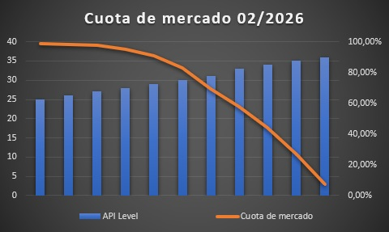

# 📱 Versiones de Android (API Levels): ¿Para quién programamos?

Antes de escribir una sola línea de código, tenemos que entender dónde va a vivir nuestra app. El mundo Android está fragmentado: hay usuarios con móviles que salieron hace 6 años y usuarios con el último modelo plegable de este mes.

En Android, las versiones comerciales del sistema operativo (Android 14, Android 15...) se traducen internamente para los desarrolladores en **Niveles de API (*API Levels*)**.

Cada vez que Google saca herramientas nuevas (como Jetpack Compose), lo hace para ciertos niveles de API. Nuestro trabajo es decidir qué versiones soportamos para equilibrar dos cosas: tener la tecnología más moderna vs. llegar al mayor número de usuarios posible.

<figure markdown="span">
  
  <figcaption>Figura 1: El eterno dilema: si usamos lo ultimísimo, perdemos usuarios antiguos. Si soportamos móviles prehistóricos, nuestro código se vuelve una pesadilla.</figcaption>
</figure>

---

## Los 3 Conceptos Clave (El archivo `build.gradle.kts`)

Cuando creamos un proyecto, el motor de Android Studio nos obliga a definir tres "números mágicos" en el archivo de configuración. Si entiendes estos tres números, te ahorrarás el 90% de los dolores de cabeza de configuración en tu vida profesional.

Así se ven en tu código:

```kotlin
// Archivo: app/build.gradle.kts
android {
    compileSdk {
        version = release(36) { // (1)!
            minorApiLevel = 1
        }
    }

    defaultConfig {
        applicationId = "es.mjs_playground.holamundo"
        minSdk = 28     // (2)!
        targetSdk = 36  // (3)!
        versionCode = 1
        versionName = "1.0"
    }
}
```

1. **El diccionario de Android Studio.** Le dice al IDE qué funciones conoce.
2. **La barrera de entrada.** La versión mínima que debe tener el móvil del usuario para poder instalar la app.
3. **Tu promesa a Google.** La versión contra la que has probado tu app a fondo.

---

### 🛠️ 1. `compileSdk` (El Diccionario)
* **¿Qué es?** Es la versión del SDK que Android Studio utiliza para compilar tu código. Le dice al entorno qué funciones, clases y métodos existen.
* **La Regla:** Siempre debe ser la versión más alta disponible (en febrero de 2026, la API 36).
* **Ejemplo:** Si intentas usar una función nueva de Bluetooth que salió en la API 35, pero tu `compileSdk` está en 33, Android Studio te marcará el código en rojo porque "no conoce" esa palabra.

### 🚪 2. `minSdk` (La Puerta de Entrada)
* **¿Qué es?** Es la versión mínima de Android que debe tener el móvil de un usuario para poder instalar tu app desde la Play Store. Si un usuario tiene un móvil más antiguo, la Play Store le dirá: *"Esta app no es compatible con tu dispositivo"*.
* **La Regla:** Es una decisión puramente de negocio. Si lo pones muy bajo (ej: API 21), tu app funcionará en el 100% de los móviles del mundo, pero tendrás que escribir mucho código "basura" extra para que las cosas modernas funcionen en móviles viejos.

### 🎯 3. `targetSdk` (La Promesa)
* **¿Qué es?** Es la versión de Android contra la que tú, como desarrollador, has probado a fondo tu app.
* **La Regla:** Suele (y debe) ser el mismo número que el `compileSdk`. Le dice al sistema operativo del usuario: *"Oye, he diseñado esta app teniendo en cuenta las reglas y restricciones de privacidad y seguridad de esta versión moderna de Android"*.

---

### 🏗️ La Analogía de la Casa (Resumen mental)

Para que no se te olvide nunca:

* **`minSdk` (Los Cimientos):** "Esta casa se aguanta en pie como mínimo en este tipo de terreno antiguo".
* **`compileSdk` (Las Herramientas):** "He construido la casa usando taladros y grúas de última generación".
* **`targetSdk` (La Inspección Técnica):** "Certifico que esta casa cumple con la normativa de seguridad de este año".

!!! success "El Estándar del Curso (2026)"
    En todos los proyectos que hagamos, configuraremos nuestro **`minSdk` en 28 (Android 9.0)**. ¿Por qué?
    
    * Cubre a la inmensa mayoría de los usuarios activos hoy en día.
    * Nos permite usar **Jetpack Compose** de forma nativa y fluida sin hacer "trucos" raros.
    * Nos ahorra pelearnos con librerías obsoletas y bugs de móviles prehistóricos. Queremos aprender arquitectura moderna, *no arqueología*.

---

Ya sabes para quién estamos programando y qué significan esos números de versión en tu código. Pero, ¿quién es el encargado de leer esos números y empaquetar tu app? Ese es el trabajo del "Motor". Vamos a conocerlo.

<div style="display: flex; justify-content: space-between; margin-top: 2rem;" markdown="span">
  [⬅️ Volver a Tu Primer Proyecto](b1-m0_2-primer_proyecto.md){: .md-button }
  [El Motor (Gradle y AGP) ➡️](b1-m0_4-motor_gradle_agp.md){: .md-button .md-button--primary }
</div>