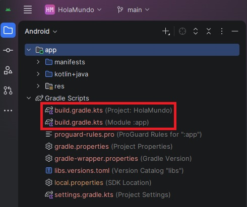
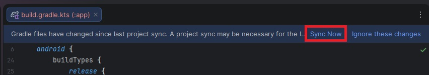

# ⚙️ El Motor: Gradle y el Android Gradle Plugin (AGP)

Has escrito tu código en Kotlin y has puesto tus imágenes en la carpeta `res`. Pero, ¿Cómo se convierte todo eso mágicamente en una aplicación (`.apk` o `.aab`) que puedes instalar en tu móvil?

Aquí es donde entra a trabajar el "trabajador en la sombra": **Gradle**.

Si tú eres el arquitecto que dibuja los planos de la app, Gradle es la empresa constructora. Se encarga de coger tus planos, comprar los materiales (librerías de internet), mezclar el cemento (compilar el código) y entregarte las llaves de la casa terminada.

### ¿Qué es el AGP (Android Gradle Plugin)?
Gradle es una herramienta genérica; sirve para construir proyectos en Java, en C++, o páginas web. Por sí solo, no tiene ni idea de qué es un móvil Android.

Para solucionarlo, Google creó el **AGP** (*Android Gradle Plugin*). Es, básicamente, el "manual de instrucciones" que le enseña a Gradle cómo construir una aplicación específicamente para Android.

---

## 👯‍♂️ El Laberinto: Los dos archivos `build.gradle.kts`

Si despliegas la sección *Gradle Scripts* en tu Android Studio, verás algo que vuelve locos a todos los programadores novatos: hay dos archivos que se llaman exactamente igual.

Esto no es un error, es una jerarquía.

<figure markdown="span">
  
  <figcaption>Figura 1: El terror de los novatos. Fíjate siempre en el texto gris que hay entre paréntesis para saber en cuál de los dos estás entrando.</figcaption>
</figure>

Vamos a ver las diferencias para que nunca te equivoques de archivo:

### 1. El archivo del Proyecto: `build.gradle.kts (Project)`
* **Para qué sirve:** Configura las reglas globales de todo el proyecto.
* **Cuándo lo tocamos:** Casi nunca. Solo entraremos aquí en módulos avanzados (como el Módulo 11) para añadir plugins muy pesados a nivel global, como el de Hilt (Inyección de dependencias) o Firebase.

### 2. El archivo del Módulo: `build.gradle.kts (Module :app)`
* **Para qué sirve:** Configura las reglas específicas de tu aplicación.
* **Cuándo lo tocamos:** ¡Constantemente! Este es tu archivo de cabecera. Aquí es donde definimos el `minSdk` que vimos en la lección anterior y, sobre todo, donde añadimos las librerías externas.

---

## 📦 El bloque `dependencies` (Cómo pedir pizza)

Dentro del archivo del Módulo (`Module :app`), al final del todo, hay un bloque fundamental llamado `dependencies { ... }`.

En Android, no tenemos que inventar la rueda constantemente. Si necesitamos cargar imágenes de internet, usamos una librería (Coil). Si necesitamos conectar con una API, usamos otra (Retrofit/Ktor). Para añadir estos "superpoderes" a tu app, solo tienes que decírselo a Gradle añadiendo una línea de texto aquí:

```kotlin
// Archivo: build.gradle.kts (Module :app)

dependencies {
    // Librerías que Android Studio pone por defecto para que Compose funcione
    implementation(libs.androidx.core.ktx)
    implementation(libs.androidx.lifecycle.runtime.ktx)
    implementation(libs.androidx.activity.compose)
    
    // 👇 Así es como nosotros añadiremos nuevos "superpoderes" en el futuro:
    // implementation("io.coil-kt:coil-compose:2.5.0") 
}
```

!!! warning "La Regla de Oro: El Elefante 'Sync Now'"
    Cada vez que escribas, borres o modifiques una sola letra en cualquier archivo `build.gradle.kts`, aparecerá una barra amarilla en la parte superior de tu pantalla con un botón que dice **Sync Now** (Sincronizar ahora).
    
    **SIEMPRE DEBES PULSAR ESE BOTÓN.** Hasta que no sincronices, Android Studio no descargará las librerías nuevas y tu código seguirá marcado en rojo como si estuviera roto.

<figure markdown="span">
  
  <figcaption>Figura 2: No ignores al elefante. Si modificas un archivo de Gradle y no sincronizas, tu proyecto no compilará.</figcaption>
</figure>

---

Ahora que ya dominamos los archivos de configuración y sabemos cómo añadir librerías, nos queda un último detalle técnico antes de saltar a programar en Kotlin. A veces, las librerías necesitan generar código por nosotros por detrás, y para ello usan procesadores de anotaciones. Vamos a ver por qué el antiguo KAPT te daba tantos dolores de cabeza y por qué el nuevo KSP nos va a salvar la vida.

<div style="display: flex; justify-content: space-between; margin-top: 2rem;" markdown="span">
  [⬅️ Volver a Versiones de API](b1-m0_3-versiones_android.md){: .md-button }
  [Procesamiento de Anotaciones ➡️](b1-m0_5-anotaciones_ksp_kapt.md){: .md-button .md-button--primary }
</div>