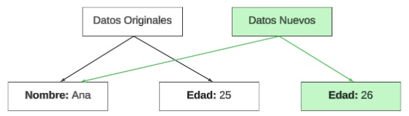

# Data Classes & Lambdas: Menos código, más potencia

Si vienes de Java, prepárate para llorar de alegría. ¿Recuerdas los POJOs (*Plain Old Java Objects*)? ¿Esas clases donde definías 3 variables y luego tenías que generar 100 líneas de código con *Getters*, *Setters*, `equals()`, `hashCode()` y `toString()`?

En Kotlin, eso se acabó. Y no solo eso: vamos a aprender a pasar funciones de un lado a otro como si fueran pelotas de tenis. Esto último es **VITAL** para entender Jetpack Compose.

---

## 1. Data Classes: La dieta milagro de tu código

Una `data class` es una clase cuya única misión en la vida es guardar datos. Al poner la palabra mágica `data` delante, Kotlin escribe automáticamente por ti todo el código aburrido (*Getters*, `toString`, comparaciones...).

### 🆚 El Choque Visual

Mira la diferencia abismal entre lo que hacías antes y lo que harás ahora:

=== "🚀 Kotlin (data class)"
    ```kotlin
    // Todo lo que necesitas está en esta única línea:
    data class Usuario(val nombre: String, val edad: Int)
    ```

=== "☕ Java (POJO)"
    ```java
    public class Usuario {
        private String nombre;
        private int edad;

        public Usuario(String nombre, int edad) {
            this.nombre = nombre;
            this.edad = edad;
        }

        public String getNombre() { return nombre; }
        public void setNombre(String nombre) { this.nombre = nombre; }
        public int getEdad() { return edad; }
        public void setEdad(int edad) { this.edad = edad; }

        @Override
        public String toString() {
            return "Usuario{nombre='" + nombre + "', edad=" + edad + '}';
        }
        
        // ... E imagina aquí otros 20 líneas para equals() y hashCode() 😫
    }
    ```


### 💻 El Método `copy()`

Las data classes tienen un superpoder oculto: el método `.copy()`. 

Como en Kotlin preferimos que todo sea inmutable (`val`), si queremos cambiar la edad de un usuario, no modificamos el objeto original. Creamos una copia exacta pero cambiando solo lo que nos interesa. Esto es **CRÍTICO** para Jetpack Compose y el patrón MVVM que veremos más adelante.

```kotlin
data class Usuario(val nombre: String, val edad: Int)

fun main() {
    val usuario1 = Usuario("Ana", 25)
    
    // usuario1.edad = 26 // ❌ Error! Es 'val', no se puede tocar.

    // ✅ Correcto: Creamos un clon actualizado
    val usuario2 = usuario1.copy(edad = 26)

    println(usuario1) // Imprime: Usuario(nombre=Ana, edad=25)
    println(usuario2) // Imprime: Usuario(nombre=Ana, edad=26)
}
```


<figure markdown="span">
  
  <figcaption>Figura 1: La magia de la inmutabilidad: Crear una copia no duplica todo el objeto, solo lo que cambia. Observa cómo ambos comparten la referencia al nombre "Ana".</figcaption>
</figure>

!!! info "Profundización: ¿Por qué esto es eficiente? (Structural Sharing)"
    Es posible que tu intuición te diga: *"¿Crear una copia entera del objeto cada vez que cambio un dato? ¡Eso tiene que ser lentísimo y llenar la memoria RAM!"*.
    
    **La realidad es justo la contraria.** Gracias a que los datos son inmutables, Kotlin aplica una técnica llamada **Compartición de Estructura (*Structural Sharing*)**:
    
    * Cuando haces un `.copy()`, Kotlin **no duplica** los datos que no han cambiado (como el nombre "Ana" del ejemplo).
    * Simplemente crea una referencia (un puntero) al dato original. Como "Ana" es inmutable, es seguro que dos objetos distintos apunten al mismo sitio de memoria sin miedo a que uno se lo cambie al otro sin avisar.
    * **Resultado:** Ahorras memoria y ganas velocidad, haciendo que las comparaciones en Jetpack Compose sean instantáneas (solo comparan referencias de memoria, no dato por dato).
    
    [**Aquí**](https://platzi.com/blog/estructuras-de-datos-inmutables/) os dejo un enlace donde se detalla más esta explicación.
---

## 2. Lambdas: Funciones como variables

Aquí es donde a muchos les explota la cabeza, pero es el concepto más importante para dibujar pantallas en Android.

Una **Lambda** no es más que una función anónima (sin nombre) que podemos guardar en una variable o pasar como parámetro a otra función.

* **Sintaxis básica:** `{ parametros -> cuerpo de la función }`

```kotlin
// Guardamos una función dentro de una variable 'suma'
val suma = { x: Int, y: Int -> x + y }

// La usamos como si fuera una función normal
val resultado = suma(5, 3) // Resultado: 8
```

---

## 3. Trailing Lambda (La sintaxis de Compose)

Presta atención, porque el 99% de tu código en Jetpack Compose va a usar esta regla sintáctica.

!!! warning "La Regla de Oro de la Sintaxis"
    Si el último parámetro de una función es otra función (una lambda), **puedes sacarla fuera de los paréntesis**.

Imagina un botón. Un botón necesita un texto (qué pone) y una acción (qué hacer al pulsar).

```kotlin
// Definición imaginaria de un Botón en Kotlin
fun Boton(texto: String, alPulsar: () -> Unit) { ... }

// 1. La forma "fea" (dentro de los paréntesis)
Boton("Enviar", { println("Enviado!") })

// 2. La forma "Compose" (Trailing Lambda) ✨
// Como la acción es el último parámetro, cerramos paréntesis y abrimos llaves.
Boton("Enviar") {
    println("Enviado!") 
}
```

---

## 4. Lambdas Multilínea: Cuando la cosa se complica

¿Qué pasa si tu función es compleja y no cabe en una línea? ¿Cómo hacemos un `return` dentro de una lambda?

!!! danger "¡Cuidado con el 'return'!"
    En una lambda **NO** se usa la palabra `return` (salvo en casos muy avanzados). En su lugar, Kotlin aplica una regla sagrada: **La última línea de la lambda es lo que se devuelve automáticamente**.

Vamos a ver un ejemplo real: una función que calcula el precio final de un producto aplicando un descuento según un cupón.

```kotlin
// Definimos una lambda que recibe precio (Double) y cupón (String?) 
// y devuelve el precio final (Double)
val calcularPrecioFinal = { precio: Double, cupon: String? ->

    // 1. Primera instrucción: Hacemos un log para depurar
    println("Procesando cupón: $cupon para precio: $precio€")

    // 2. Segunda instrucción: Lógica condicional
    val porcentajeDescuento = if (cupon == "PRO2026") {
        println("¡Cupón válido!")
        0.20 // 20% de descuento
    } else {
        println("Cupón no válido o vacío")
        0.0  // Sin descuento
    }

    // 3. Tercera instrucción (LA ÚLTIMA): El Retorno
    // Kotlin evalúa esta línea y la "escupe" como resultado de la función.
    precio * (1 - porcentajeDescuento) // (1)!
}

fun main() {
    // Probamos la lambda
    val precio1 = calcularPrecioFinal(100.0, "PRO2026")
    println("Precio final: $precio1€") // Imprime: 80.0€
    
    val precio2 = calcularPrecioFinal(50.0, null)
    println("Precio final: $precio2€") // Imprime: 50.0€
}
```

1. Fíjate que no hay palabra `return`. Simplemente poniendo la operación matemática al final, la Lambda entiende que ese es el valor a devolver.


!!! warning "Regla de oro"
    En una lambda, lo que pongas en la última línea es lo que se devuelve automáticamente.

---

!!! note "Resumen para tu cerebro 🧠"
    * **Data Class:** Usa `data class` para tus modelos de datos. Usa siempre `val`.
    * **Structural Sharing:** El método `.copy()` es ultra-eficiente porque recicla la memoria de los datos que no cambian.
    * **Lambdas:** Son funciones que viajan como datos.
    * **Trailing Lambda:** Si la función es el último argumento, sácala fuera de los paréntesis `{ }`.

Ahora que sabemos guardar datos de forma eficiente y pasar funciones, vamos a ver cómo darle superpoderes a clases que no son nuestras con las Extension Functions.

<div style="display: flex; justify-content: space-between; margin-top: 2rem;" markdown="span">
  [⬅️ Volver a Val vs Var](b1-m1_1-val_var_null_safety.md.md){: .md-button }
  [1.3. Extension Functions ➡️](b1-m1_3-extension_functions.md){: .md-button .md-button--primary }
</div>
