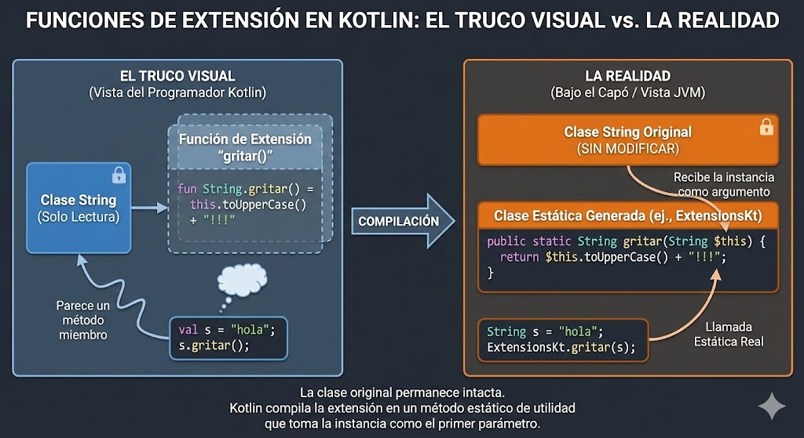

# Extension Functions: Inyectando superpoderes

Imagina que estás usando la clase `String` de Kotlin. Es una clase que tú no has escrito (viene en el lenguaje) y, por tanto, no puedes modificar su código fuente. No puedes abrir el archivo `String.kt` y añadirle un método nuevo.

En Java, si queríamos validar si un texto era un email, teníamos que crear clases "ayudantes" horribles llamadas `StringUtils` o `Validators`.

### 🆚 El cambio de paradigma

Mira cómo cambia la legibilidad del código:

=== "🚀 Kotlin (Extension Functions)"
    ```kotlin
    // ¿Y si pudiéramos "fingir" que el método es parte de la clase String?
    // Llamamos al método como si fuera nativo. ✨
    if (miCorreo.esEmailValido()) { 
        // ... 
    }
    ```

=== "☕ Java"
    ```java
    // Teníamos que llamar a una clase externa estática
    // y pasarle nuestro objeto como parámetro. 🤢
    if (ValidatorUtils.esEmailValido(miCorreo)) { 
        // ... 
    }
    ```


Esto es una **Extension Function**. Nos permite añadir funcionalidad a clases que no son nuestras (`Strings`, `Integers`, `Views`, `Contexts`...) **sin necesidad de herencia ni patrones complejos**.

---

## 💻 ¿Cómo se crean?

La sintaxis es muy sencilla. Solo tienes que poner el nombre de la clase que quieres extender, un punto, y el nombre de tu nueva función.

Dentro de la función, usamos la palabra clave `this` para referirnos al objeto que está llamando a la función (en este caso, el propio texto).

### Ejemplo: Validar un Email

```kotlin
// 1. Definimos la extensión sobre la clase 'String'
fun String.esEmailValido(): Boolean {
    // 'this' se refiere al texto concreto (ej: "pepe@gmail.com")
    // Usamos un patrón regex simple para comprobar si tiene formato de correo
    val patronEmail = android.util.Patterns.EMAIL_ADDRESS // (1)!
    return patronEmail.matcher(this).matches() // (2)!
}

fun main() {
    val correoUsuario = "alumno@fp.com"
    val correoFalso = "esto-no-es-un-correo"

    // 2. ¡Magia! El autocompletado de Android Studio ahora nos sugiere 
    // nuestra función como si fuera nativa de Kotlin.
    println(correoUsuario.esEmailValido()) // Imprime: true
    println(correoFalso.esEmailValido())   // Imprime: false
}
```

1. La clase `android.util.Patterns` es una joya oculta. Además de email, ya incluye validadores nativos para **Teléfonos** (`Patterns.PHONE`), **URLs web** (`Patterns.WEB_URL`) y **Direcciones IP** (`Patterns.IP_ADDRESS`). ¡Úsalos antes de inventar tu propia expresión regular compleja!
2. La palabra clave `this` actúa como el sujeto de la oración. Si escribes `"hola".esEmailValido()`, dentro de la función, `this` valdrá `"hola"`.


<figure markdown="span">
  
  <figcaption>Figura 1: No estamos modificando el código original de la clase String (que es de solo lectura). Kotlin crea un "truco" visual para que parezca que el método pertenece a ella.</figcaption>
</figure>

---

## 🛠️ Otro ejemplo útil: Formato de Moneda

Imagina que trabajas con precios. Tienes un `Double` (ej: 19.99) y quieres mostrarlo bonito en la pantalla (19,99 €).

```kotlin
// Extendemos la clase Double
fun Double.aFormatoEuro(): String {
    // Usamos 'this' para acceder al valor numérico (19.99)
    return "$this €"
}

fun Double.conDescuento(porcentaje: Int): Double {
    return this - (this * porcentaje / 100)
}

fun main() {
    val precioCamiseta = 20.0
    
    // Podemos encadenar extension functions una detrás de otra 🔗
    println(precioCamiseta.conDescuento(50).aFormatoEuro()) 
    // Imprime: "10.0 €"
}
```

---

## 🚀 ¿Por qué esto es vital para Compose?

Quizás pienses: *"Vale, es azúcar sintáctico para ahorrarme una clase estática"*. Pero en Jetpack Compose, las Extension Functions son la base de todo el diseño.

Cuando escribes un modificador para cambiar el aspecto de un botón:

```kotlin
// Todo esto son Extension Functions
Modifier
    .padding(16.dp)
    .background(Color.Red)
    .clickable { ... }
```

En realidad, `.padding()`, `.background()` y `.clickable()` son funciones de extensión que Google ha creado sobre la clase `Modifier`. Gracias a ellas, podemos encadenar configuraciones de forma fluida y legible.


!!! note "Recuerda"
    Usa las extension functions para crear código que se lea como una frase natural. Es mucho más fácil leer `usuario.esMayorDeEdad()` que leer `Utils.verificarEdad(usuario)`.

---

Ahora que sabemos potenciar clases existentes, vamos a ver cómo Kotlin revoluciona la forma en que trabajamos con listas de datos.

<div style="display: flex; justify-content: space-between; margin-top: 2rem;" markdown="span">
  [⬅️ Volver a Data Classes](b1-m1_2-data_class_lambdas.md){: .md-button }
  [1.4. Colecciones Modernas ➡️](b1-m1_4-colecciones_modernas.md){: .md-button .md-button--primary }
</div>