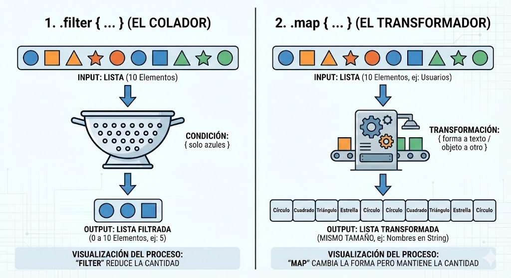

# Colecciones Modernas: El fin de los bucles for

Si vienes de Java o C, tu cerebro está programado para resolver cualquier problema con listas usando un bucle `for` (o `foreach`).

**El problema de los bucles tradicionales:**
Para hacer algo tan simple como *"dame los nombres de los usuarios mayores de edad"*, en el estilo antiguo tienes que:

1. Crear una lista vacía temporal.
2. Abrir un bucle.
3. Meter un `if` dentro.
4. Añadir elementos a la lista temporal.
5. Devolver la lista.

En Kotlin, adoptamos la **Programación Funcional**. En lugar de decirle al ordenador *cómo* iterar paso a paso, le decimos *qué* queremos conseguir aplicando transformaciones en cadena. Es como una cadena de montaje industrial.

---

## 🆚 El Cara a Cara: Imperativo vs Funcional

Imagina que tenemos una lista de números: `val numeros = listOf(1, 2, 3, 4, 5, 6)`.
Queremos: **Quedarnos con los pares y multiplicarlos por 10**.

=== "Funcional (La forma Kotlin)"
    ```kotlin
    val resultado = numeros
        .filter { it % 2 == 0 } // 1. Primero filtramos
        .map { it * 10 }        // 2. Luego transformamos
    
    // Resultado: [20, 40, 60]
    // ✨ Se lee como una frase: "Filtra los pares y mapéalos por 10".
    ```

=== "Imperativo (La forma antigua)"
    ```kotlin
    val resultado = mutableListOf<Int>()
    
    for (numero in numeros) {
        if (numero % 2 == 0) {
            resultado.add(numero * 10)
        }
    }
    
    // Resultado: [20, 40, 60]
    // 😫 Mucho código, variables mutables y ruido visual.
    ```

---

## 🛠️ Las 3 Herramientas Sagradas

Para sobrevivir en Android, necesitas dominar estas tres funciones. Son el pan de cada día:

### 1. `.filter { ... }` (El Colador)
Crea una lista nueva que contiene **solo** los elementos que cumplen una condición (devuelven `true`).

* **Input:** Una lista de 10 elementos.
* **Output:** Una lista de 0 a 10 elementos (nunca más que la original).

### 2. `.map { ... }` (El Transformador)
Crea una lista nueva del **mismo tamaño**, pero transformando cada elemento en otra cosa. Es vital para pasar de objetos de Base de Datos a objetos visuales para la UI.

* **Input:** Una lista de Usuarios.
* **Output:** Una lista de Strings (solo sus nombres), o de Colores...

### 3. `.find { ... }` (El Buscador)
No devuelve una lista. Devuelve el **primer elemento** que coincida con la condición, o `null` si no encuentra ninguno.

* **Input:** Una lista.
* **Output:** Un elemento individual (o `null`).


<figure markdown="span">
  
  <figcaption>Figura 1: Visualización del proceso: 'Filter' reduce la cantidad, 'Map' cambia la forma pero mantiene la cantidad.</figcaption>
</figure>

---

## 💻 Ejemplo Real: Gestión de Usuarios

Vamos a dejarnos de números abstractos. Así es como se usa esto en una App real. Tenemos una lista de objetos `Usuario`.

```kotlin
data class Usuario(val nombre: String, val esPremium: Boolean, val edad: Int)

fun main() {
    val usuarios = listOf(
        Usuario("Ana", true, 25),
        Usuario("Pedro", false, 30),
        Usuario("Lucía", true, 17),
        Usuario("Javi", false, 40)
    )

    // OBJETIVO: Queremos los NOMBRES de los usuarios PREMIUM mayores de edad en mayúsculas

    val nombresVip = usuarios
        .filter { it.esPremium }    // 1. Nos quedamos solo con los Premium (Ana, Lucía)
        .filter { it.edad >= 18 }   // 2. Filtramos los mayores de edad (Ana)
        .map { it.nombre }          // 3. ¡Magia! Convertimos objetos Usuario en Strings
        .map { it.uppercase() }     // 4. Los ponemos en mayúsculas

    println(nombresVip)
    // Imprime: [ANA]
    // (Lucía era menor, Pedro y Javi no eran premium)
}
```

!!! question "¿Qué es ese 'it'?"
    Habrás visto que usamos mucho la palabra `it`. En Kotlin, cuando una lambda tiene **un solo parámetro**, no hace falta ponerle nombre (ej: `usuario ->`). Podemos referirnos a él automáticamente como `it` (*eso*/*ello*). 
    
    Es muy cómodo para operaciones cortas, pero si anidas varios `map`, es mejor ponerle nombre explícito para no liarte.

---

## 🧐 ¿Y si quiero hacer un bucle normal?

A veces solo quieres recorrer la lista para pintar cosas en el Log, sin transformar nada. En ese caso, evita el `for` clásico y usa `.forEach`:

```kotlin
// Estilo Kotlin
nombresVip.forEach { nombre ->
    println("Enviando cupón a: $nombre")
}
```

---

Ya sabes manipular datos como un profesional. Ahora nos falta una pieza clave: en Android no podemos permitir que una operación lenta (como filtrar una lista de 10.000 usuarios) bloquee la pantalla y congele el móvil. Para eso existen las Corrutinas.

<div style="display: flex; justify-content: space-between; margin-top: 2rem;" markdown="span">
  [⬅️ Volver a Extension Functions](b1-m1_3-extension_functions.md){: .md-button }
  [1.5. Corrutinas Básicas ➡️](b1-m1_5-corrutinas_basicas.md){: .md-button .md-button--primary }
</div>