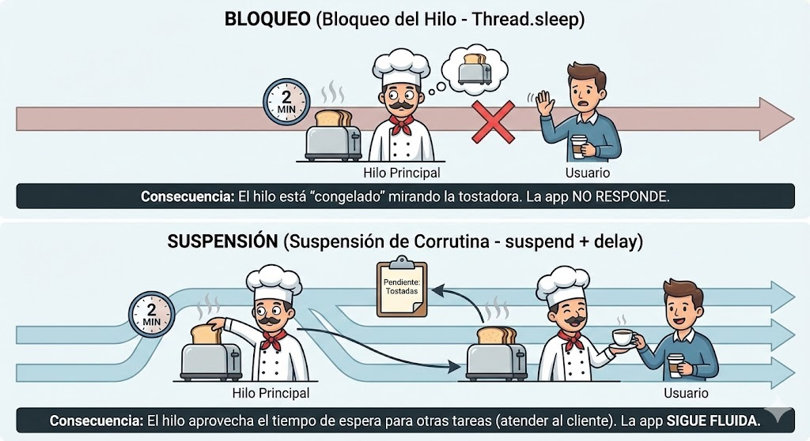

# Corrutinas Básicas: El arte de esperar sin congelarse

Llegamos al concepto más difícil pero más revolucionario de Kotlin.

En Android, existe una regla sagrada: **El Hilo Principal (*Main Thread*) es intocable**. Este hilo es el encargado de dibujar la interfaz y reaccionar a los toques del usuario.

* Si haces una operación pesada (descargar un archivo, consultar una base de datos) en este hilo, la app se congela.
* Si tarda más de 5 segundos, el sistema operativo mata tu app y muestra el temido mensaje **ANR** (*Application Not Responding*).

Antiguamente, para evitar esto usábamos "Hilos" (*Threads*) y "Callbacks", creando un código espagueti ilegible. Hoy, usamos **Corrutinas**.

---

## 🛑 Bloquear vs. Suspender (La Analogía del Desayuno)

Para entender esto, imagina que eres un cocinero (el Hilo Principal) preparando el desayuno. Tienes que hacer tostadas.

!!! example "El Dilema de la Tostadora"
    **1. Bloquear el Hilo (`Thread.sleep`)**
    Metes el pan en la tostadora (tarda 2 minutos). Como estás "bloqueado", te quedas mirando fijamente la tostadora sin moverte hasta que salta.
    
    * **Consecuencia:** Si entra un cliente (el usuario) a pedir café, no puedes atenderle porque estás "congelado" mirando la tostadora. La app no responde.

    **2. Suspender la Ejecución (`suspend` + `delay`)**
    Metes el pan en la tostadora. Mientras se hace, anotas mentalmente que tienes una tarea pendiente (suspensión) y te vas a preparar el café o a atender al cliente. Cuando la tostadora hace "clinc", vuelves a ella.
    
    * **Consecuencia:** Has hecho dos cosas a la vez sin necesidad de clonarte (crear otro hilo). La app sigue fluida.


<figure markdown="span">
  
  <figcaption>Figura 1: Arriba: Bloqueo (el hilo no hace nada más). Abajo: Suspensión (el hilo aprovecha el tiempo de espera para otras tareas).</figcaption>
</figure>

---

## ⚡ La palabra mágica: `suspend`

En Kotlin, para avisar al compilador de que una función puede "pausarse" sin bloquear el hilo, le ponemos la etiqueta `suspend`.

```kotlin
// Función normal (Bloqueante si tarda mucho)
fun prepararCafe(): String {
    // ... lógica pesada ...
    return "Café listo" 
}

// Función de suspensión (No bloqueante)
suspend fun descargarDatosDeInternet(): String {
    // Simulamos una espera de 2 segundos sin congelar la app
    delay(2000) 
    return "Datos descargados"
}
```

!!! danger "La Regla de Oro de las Corrutinas"
    Una función `suspend` **SOLO** puede ser llamada desde:
    
    1.  Otra función `suspend`.
    2.  Una Corrutina (un bloque constructor como `launch` o `runBlocking`).
    
    No puedes llamar a una función suspendida desde un botón normal sin preparar antes el terreno (lo veremos en la práctica).

---

## 🛠️ Código: Thread vs Coroutine

Vamos a ver la diferencia real en código. Fíjate bien en la salida de cada uno.

=== "✅ La forma Kotlin (Suspensión)"
    ```kotlin
    import kotlinx.coroutines.*

    fun main() = runBlocking { // Creamos un entorno de corrutinas
        println("Empieza el programa")

        launch { // Lanzamos una tarea en "segundo plano" (concurrente)
            delay(1000) // Pausa de 1 seg SIN bloquear el hilo principal
            println("Tarea terminada")
        }
        
        println("El hilo principal sigue trabajando...")
    }
    
    // SALIDA:
    // 1. Empieza el programa
    // 2. El hilo principal sigue trabajando... (¡No se esperó!)
    // 3. (1 segundo después) Tarea terminada
    ```

=== "❌ La forma antigua (Bloqueante)"
    ```kotlin
    fun main() {
        println("Empieza el programa")
        
        // Esto CONGELA el hilo durante 1 segundo. 
        // Si fuera una app Android, la pantalla se quedaría negra.
        Thread.sleep(1000) 
        
        println("Termina el programa")
    }
    ```

---

## 🚦 Los Dispatchers (¿Dónde ejecutamos el código?)

En Android, no basta con suspender. A veces necesitamos mover el trabajo pesado a un carril diferente de la autopista para no molestar a la UI (la interfaz). Para eso usamos los **Dispatchers**.

* 🎨 **`Dispatchers.Main`:** Es el hilo de la UI. Úsalo solo para cosas ligeras y para pintar en pantalla.
* 💾 **`Dispatchers.IO`:** (*Input/Output*). Optimizado para leer bases de datos, ficheros o redes. Aquí es donde haremos las llamadas a la API o Room.
* 🧠 **`Dispatchers.Default`:** Para cálculos matemáticos pesados (procesar una foto, algoritmos complejos) que usan mucha CPU.

### Ejemplo de cambio de hilo (`withContext`)

Es el patrón más común que usarás en el curso.

```kotlin
suspend fun loginUsuario(user: String, pass: String) {
    // 1. Estamos en el hilo Main (UI), mostramos un spinner
    mostrarCargando() // (1)!

    // 2. Nos movemos al hilo IO para conectar con el servidor
    val resultado = withContext(Dispatchers.IO) { // (2)!
        api.conectar(user, pass) // Esto tarda 3 segundos
    }

    // 3. Volvemos automáticamente al hilo Main para mostrar el resultado
    ocultarCargando() // (3)!
    mostrarBienvenida(resultado)
}
```

1.  Esta función actualiza la UI, por lo tanto debe correr en el hilo principal.
2.  `withContext` suspende la función `loginUsuario`, mueve la ejecución al hilo secundario (IO), espera a que termine, y devuelve el resultado.
3.  Al salir del bloque `withContext`, Kotlin nos devuelve automáticamente al hilo original (Main) para que podamos seguir tocando la interfaz.

---

!!! success "🎉 ¡Fin del Bloque 1!"
    Has sobrevivido a la teoría. Sabes configurar Android Studio, entiendes por qué Kotlin es más seguro que Java, manejas listas con programación funcional y entiendes que bloquear el hilo principal es pecado mortal.
    
    Ahora toca demostrarlo. Prepárate, porque tu primera Práctica del Módulo consiste en arreglar un código desastroso que rompe todas las reglas que acabamos de aprender.

<div style="display: flex; justify-content: space-between; margin-top: 2rem;" markdown="span">
  [⬅️ Volver a Colecciones](b1-m1_4-colecciones_modernas.md){: .md-button }
  [👨‍💻 Ir a la Práctica: "El código Frankenstein" ➡️](b1-m1-practica.md){: .md-button .md-button--primary }
</div>