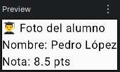
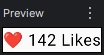
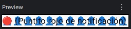
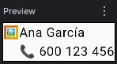

# Layouts Primitivos: Column, Row y Box

Si en la lección anterior ponías dos funciones `Text()` seguidas dentro de tu `setContent`, habrás notado algo terrible: los textos se escriben uno exactamente encima del otro, creando un manchón ilegible.

Compose es muy rápido, pero no lee mentes. Si no le dices cómo organizar los elementos en el espacio, los dibuja todos en la coordenada (0,0) de la pantalla (arriba a la izquierda).

Para darles orden, utilizamos los **Layouts Primitivos**. Olvídate de los viejos `LinearLayout`, `RelativeLayout` o `FrameLayout` de XML. En Compose, el 99% de las interfaces del mundo real se construyen combinando solo tres piezas básicas de Lego.

---

## ⬇️ Column (Eje Y: Arriba a Abajo)

El layout más utilizado. `Column` toma todos los elementos (hijos) que pongas dentro de sus llaves y los apila verticalmente, uno debajo del otro.


**💻 El Código:**
Imagina la típica tarjeta de un alumno: Foto, debajo el nombre, y debajo la nota.

```kotlin
@Composable
fun PerfilAlumno() {
    // Todo lo que esté aquí dentro se apilará hacia abajo
    Column {
        Text(text = "👨‍🎓 Foto del alumno") // Fila 1
        Text(text = "Nombre: Pedro López")  // Fila 2
        Text(text = "Nota: 8.5 pts")        // Fila 3
    }
}
```

<figure markdown="span">
  
  <figcaption>Figura 1: La Preview nos permite ver cómo quedará nuestro elemento en un móvil sin necesidad de probar en el emulador.</figcaption>
</figure>

---

## ➡️ Row (Eje X: Izquierda a Derecha)

El hermano horizontal. `Row` toma los elementos y los coloca uno al lado del otro en la misma línea.


**💻 El Código:**
Imagina un botón de "Me gusta" que tiene un icono del corazón y, justo a su derecha, el número de *likes*.

```kotlin
@Composable
fun BotonLike() {
    // Todo lo que esté aquí dentro se pondrá en fila india
    Row {
        Text(text = "❤️")           // Izquierda
        Text(text = " 142 Likes")   // Derecha
    }
}
```

<figure markdown="span">
  
</figure>

---

## 🥞 Box (Eje Z: Profundidad / Superposición)

Aquí es donde Compose brilla frente al viejo XML. A veces no quieres cosas al lado ni debajo; quieres cosas **encima** de otras.

Piensa en `Box` como las capas de Photoshop. El primer elemento que escribes es la capa del fondo. El siguiente elemento se dibuja por encima, tapando al anterior.


**💻 El Código:**
Imagina un avatar con un circulito rojo de "notificación nueva" superpuesto en la esquina, o una imagen de fondo con texto por encima.

```kotlin
@Composable
fun AvatarConNotificacion() {
    // El modelo de capas
    Box {
        // Capa 1: Al fondo imagen de perfil gigante
        Text(text = "👤👤👤👤👤👤👤👤👤👤👤👤")
        
        // Capa 2: Se dibuja ENCIMA de la Capa 1
        Text(text = "🔴 (Puntito rojo de notificación)")
    }
}
```

<figure markdown="span">
  
</figure>

---

## 🏗️ El Poder de la Composición (Anidamiento)

La verdadera magia ocurre cuando combinas estas tres piezas. Como las interfaces en Compose son simplemente funciones dentro de otras funciones, puedes anidar `Rows` dentro de `Columns`, y `Columns` dentro de `Boxes` hasta conseguir el diseño que quieras.

Mira este ejemplo de una tarjeta de contacto típica:


```kotlin
@Composable
fun TarjetaContacto() {
    Row { // Contenedor principal: Izquierda foto, Derecha datos
        Text(text = "🖼️") // La foto a la izquierda
        
        Column { // A la derecha, apilamos nombre y teléfono verticalmente
            Text(text = "Ana García")
            Text(text = "📞 600 123 456")
        }
    }
}
```

<figure markdown="span">
  
</figure>

!!! warning "⚠️ Un problema a la vista"
    Si pruebas el código anterior, verás que funciona, pero los textos están pegadísimos. No hay márgenes, los colores son aburridos y si tocas la pantalla no pasa nada. Los Layouts Primitivos solo agrupan, **no decoran**.

Para darles márgenes, centrar los elementos, poner fondos de colores y hacer que reaccionen a los toques del usuario, necesitamos introducir el concepto más poderoso y peligroso de Jetpack Compose: Los Modificadores.

<div style="display: flex; justify-content: space-between; margin-top: 2rem;" markdown="span">
  [⬅️ Volver a Hola Compose](b1-m2_1-hola_compose.md){: .md-button }
  [Modifiers (La Magia) ➡️](b1-m2_3-modifiers.md){: .md-button .md-button--primary }
</div>