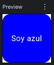

# Modifiers: Dando vida a tus componentes

Si en la lección anterior apilaste textos usando `Column` o `Row`, te habrás dado cuenta de que el resultado era bastante triste: todo estaba pegado a los bordes, sin colores, sin márgenes y sin reaccionar a tus toques.

En el viejo mundo de XML, para cambiar el color de fondo o el margen de un botón, tenías que añadir atributos como `android:layout_marginTop="16dp"` o `android:background="@color/red"`.

En Jetpack Compose, todo el aspecto visual y el comportamiento interactivo se controla con un único objeto mágico: el **Modifier**. Piensa en **los Modifiers como el CSS de tus componentes, pero vitaminado con Kotlin**.

---

## ¿Qué es un Modifier? (Encadenando superpoderes)

Un `Modifier` es un objeto de Kotlin que te permite decorar o añadir comportamiento a un Composable. Prácticamente todos los componentes de Compose (`Text`, `Button`, `Column`, `Row`, `Box`...) aceptan un parámetro llamado `modifier`.

¿Recuerdas las [*Extension Functions*](../modulo_1/b1-m1_3-extension_functions.md) del Módulo 1? Los modificadores se basan exactamente en eso. Empiezas con la palabra clave `Modifier` y le vas encadenando funciones separadas por puntos.

### Ejemplo básico de decoración:
Imagina que queremos una caja (`Box`) de 100x100 píxeles, con fondo azul y bordes redondeados.

```kotlin
@Composable
fun CajaDecorada() {
    Box(
        modifier = Modifier
            .size(100.dp) // 1. Tamaño fijo
            .clip(RoundedCornerShape(16.dp)) // 2. Recortamos las esquinas
            .background(Color.Blue), // 3. Pintamos el fondo
        contentAlignment = Alignment.Center // 4. Centramos el texto
    ) {
        Text(text = "Soy azul", color = Color.White)
    }
}
```

<figure markdown="span">
  
</figure>

!!! info "📏 Unidades de medida en Compose"
    En Android no usamos píxeles normales, usamos **dp** (*Density-independent Pixels*) para evitar que tu botón se vea gigante en un móvil viejo y minúsculo en una pantalla 4K. Para usar `dp` en Kotlin, aplicamos una *Extension Function* sobre el número: escribimos `16.dp`, `100.dp`, etc.

---

## La Regla de Oro: El orden es CRÍTICO

Presta muchísima atención aquí, porque este es el error número 1 de cualquier alumno (y profesional) que empieza con Jetpack Compose.

En XML, si ponías `padding="16dp"` y luego `background="red"`, el orden en el que escribías esas líneas daba igual. En Compose, **EL ORDEN ALTERA EL PRODUCTO**.

Compose lee los modificadores de forma secuencial, **de arriba a abajo**. Cada modificador crea una nueva "capa" que envuelve a la anterior.

### El Choque Visual (Padding 🆚 Background)

Vamos a ver qué pasa si alteramos el orden de los mismos dos modificadores:

=== "✅ Caso A: Fondo -> Margen Interior"
    ```kotlin
    Text(
        text = "Hola Mundo",
        modifier = Modifier
            .background(Color.Green) // 1. Pinta el fondo de verde
            .padding(16.dp)          // 2. Empuja el texto hacia dentro (Margen interior)
    )
    ```
    **Resultado A:** Verás un bloque verde grande. El texto está dentro, separado de los bordes verdes por 16dp. *(Es el comportamiento habitual de un padding).*

=== "⚠️ Caso B: Margen Exterior -> Fondo"
    ```kotlin
    Text(
        text = "Hola Mundo",
        modifier = Modifier
            .padding(16.dp)          // 1. Crea un espacio transparente alrededor
            .background(Color.Green) // 2. Pinta el fondo (solo del espacio que queda dentro)
    )
    ```
    **Resultado B:** Verás el texto envuelto en un fondo verde ajustado a las letras, y un espacio transparente de 16dp alrededor de toda la caja. ¡El `padding` ha actuado como un `margin` de CSS/XML!


<figure markdown="span">
  
  <figcaption>Figura 1: Visualización del orden. Fíjate cómo el modificador que se declara primero (arriba) afecta al área exterior, y el que se declara después afecta al contenido interior.</figcaption>
</figure>

---

## Comportamiento (Haciendo click)

Los Modifiers no solo sirven para pintar colores o dar tamaños. También **inyectan interactividad**. El más importante que usarás es `.clickable { }`.

¿Quieres que cualquier texto, imagen o caja reaccione como un botón? Ponle un `clickable`.

```kotlin
@Composable
fun TarjetaClickable() {
    Row(
        modifier = Modifier
            .fillMaxWidth() // Ocupa todo el ancho de la pantalla disponible
            .padding(16.dp)
            .clickable { 
                // Aquí usamos una Lambda para definir qué pasa al hacer click
                println("¡Has pulsado la fila entera!") 
            }
    ) {
        Text(text = "Toca cualquier parte de esta fila")
    }
}
```

---

!!! summary "🧠 Resumen del Arsenal de Modifiers"
    Aquí tienes tu "navaja suiza" de modificadores que usarás todos los días en el aula:
    
    * **Tamaño:** `.size(100.dp)`, `.fillMaxWidth()`, `.fillMaxSize()` (Ocupar todo el espacio).
    * **Espaciado:** `.padding(16.dp)` (Recuerda: según dónde lo pongas, actúa como margen exterior o interior).
    * **Aspecto:** `.background(Color.Red)`, `.clip(CircleShape)` (Para hacer avatares redondos).
    * **Acción:** `.clickable { }`.

Ya sabemos cómo construir la interfaz y cómo darle estilo. Pero seguir programando "a ciegas" y darle al botón de "Play" para encender el emulador cada vez que cambiamos un color es una tortura. Vamos a encender las luces del estudio.

<div style="display: flex; justify-content: space-between; margin-top: 2rem;" markdown="span">
  [⬅️ Volver a Layouts Primitivos](b1-m2_2-layouts_primitivos.md){: .md-button }
  [Preview & Tooling ➡️](b1-m2_4-preview_tooling.md){: .md-button .md-button--primary }
</div>