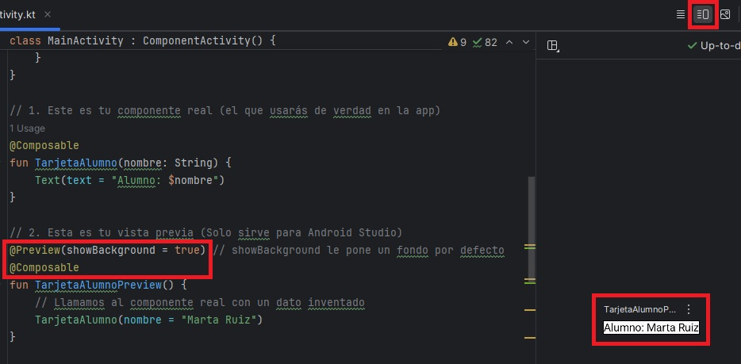
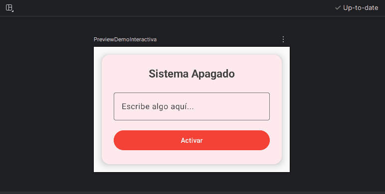

# Preview & Tooling: Diseñando en tiempo real ⚡

Si has programado para Android antes, conoces este dolor: cambias un color, ajustas un margen, le das al botón de "Play", esperas minutos a que Gradle compile, el emulador arranca... y te das cuenta de que te has equivocado y el margen era de `16.dp` en lugar de `160.dp`. Vuelta a empezar.

En Jetpack Compose, eso se acabó. Gracias a las **herramientas de Preview**, podemos ver los cambios en nuestra interfaz gráfica **al instante**, directamente en Android Studio, sin necesidad de encender el emulador físico o virtual.

---

## La magia de la etiqueta `@Preview`

Para ver un componente en la pantalla de diseño de Android Studio, solo necesitas crear una función nueva y ponerle dos etiquetas: `@Composable` y `@Preview`.

La regla es simple: una función `@Preview` **no puede recibir parámetros**. Su único trabajo es llamar al componente real pasándole datos de prueba (datos falsos o *mockeados*) para que Android Studio sepa qué dibujar.

**💻 El Código:**

```kotlin
import androidx.compose.runtime.Composable
import androidx.compose.ui.tooling.preview.Preview
import androidx.compose.material3.Text

// 1. Este es tu componente real (el que usarás de verdad en la app)
@Composable
fun TarjetaAlumno(nombre: String) {
    Text(text = "Alumno: $nombre")
}

// 2. Esta es tu vista previa (Solo sirve para Android Studio)
@Preview(showBackground = true) // showBackground le pone un fondo por defecto
@Composable
fun TarjetaAlumnoPreview() {
    // Llamamos al componente real con un dato inventado
    TarjetaAlumno(nombre = "Marta Ruiz") 
}
```

<figure markdown="span">
  
  <figcaption>Figura 1: Para ver el resultado, fíjate en la esquina superior derecha del editor de código en Android Studio. Verás tres botones: <strong>Code</strong>, <strong>Split</strong> y <strong>Design</strong>. Haz clic en <strong>Split</strong> para ver tu código a la izquierda y el resultado visual renderizado automáticamente a la derecha.</figcaption>
</figure>

---

## Modo Interactivo: Tocando sin emulador

Ver una imagen estática está genial, pero ¿qué pasa si tu botón tiene un efecto al pulsarlo o cambia de color? ¿Tienes que abrir el emulador para probarlo? No.

En el panel de Preview, justo encima de tu diseño renderizado, verás un pequeño icono que parece una mano con un dedo apuntando (o un pequeño botón de "Play" interactivo, según la versión de Android Studio).

Si lo pulsas, entras en el **Interactive Mode**.

* El componente "cobra vida" dentro del propio panel de diseño.
* Puedes hacer clic en los botones, escribir en los campos de texto y ver cómo cambian los colores y las animaciones en tiempo real.
* Todo esto consumiendo una fracción de la memoria RAM que usaría el pesado emulador completo.


<figure markdown="span">
  
  <figcaption>Gif 1: El Modo Interactivo te permite probar la usabilidad y los estados visuales en milisegundos sin salir del editor.</figcaption>
</figure>

---

## Multi-Preview: El truco profesional

¿Quieres ver cómo queda tu diseño en Modo Claro y en Modo Oscuro a la vez? ¿Y en la pantalla de un móvil pequeño frente a la de una tablet?

Puedes apilar múltiples etiquetas `@Preview` sobre la misma función de vista previa. Android Studio generará un panel de diseño para cada una de ellas de forma simultánea.

```kotlin
import android.content.res.Configuration

// Multi-Preview: Apilamos las etiquetas
@Preview(name = "Modo Claro", showBackground = true)
@Preview(
    name = "Modo Oscuro", 
    uiMode = Configuration.UI_MODE_NIGHT_YES, // Forzamos el tema oscuro
    showBackground = true
)
@Composable
fun TarjetaAlumnoPreview() {
    TarjetaAlumno(nombre = "Javier Fernández")
}
```

**Resultado:** En tu panel lateral aparecerán dos tarjetas renderizadas: una luminosa y otra oscura, una debajo de la otra. Si cambias el código de `TarjetaAlumno`, ¡ambas vistas se actualizarán a la vez!

---

Tener un buen flujo de trabajo con las Previews te ahorrará muchísimas horas a lo largo del curso. Ahora que ya sabemos diseñar y probar rápidamente de forma visual, nos queda un último detalle crítico antes de cerrar este módulo: asegurarnos de que nuestras pantallas las puede usar todo el mundo.

<div style="display: flex; justify-content: space-between; margin-top: 2rem;" markdown="span">
  [⬅️ Volver a Modifiers](b1-m2_3-modifiers.md){: .md-button }
  [Accesibilidad ➡️](b1-m2_5-accesibilidad_por_defecto.md){: .md-button .md-button--primary }
</div>